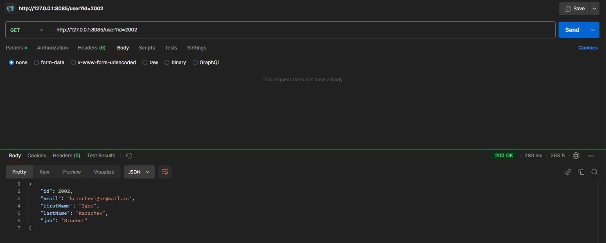
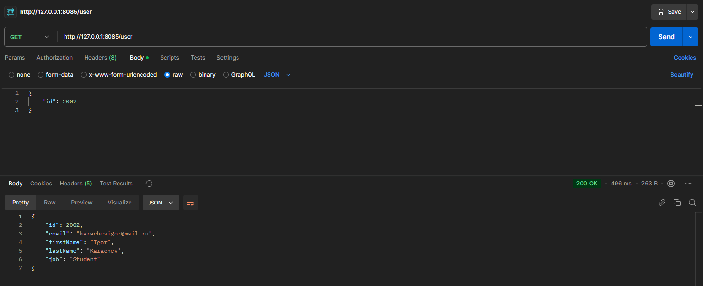
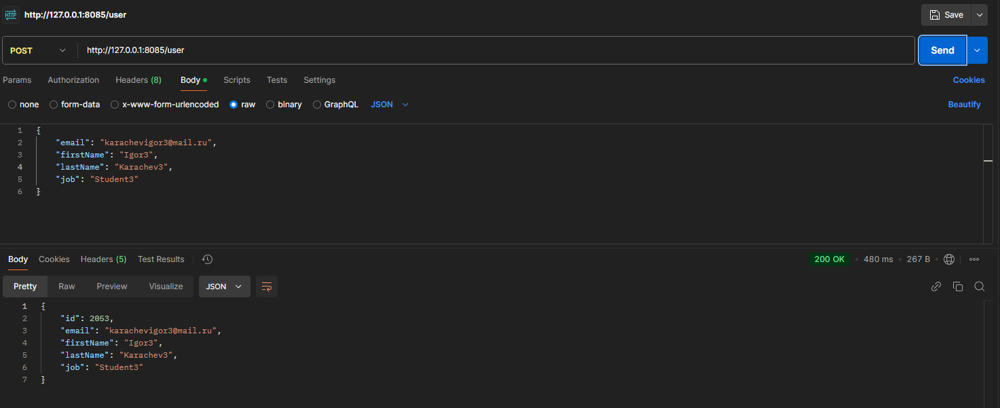
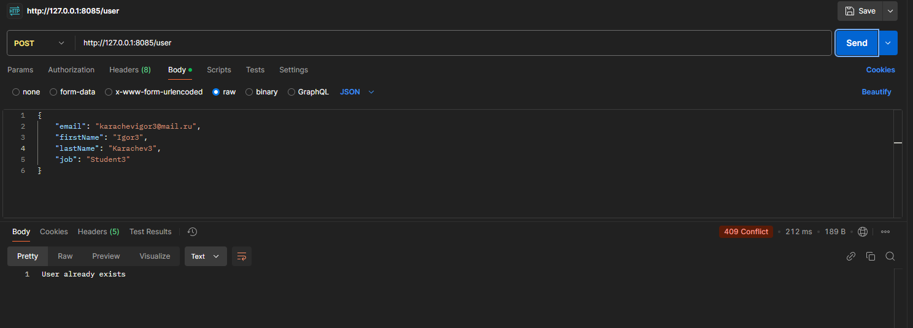

# Практическая 5

---

### Запрос на получение пользователя через URL

## 

### Запрос на получение пользователя через тело запроса

## 

### Добавление пользователя через POST запрос

## 

### Запрос на получение пользователя через тело запроса

---

### Проверка на повторное добавление существующих данных пользователя

